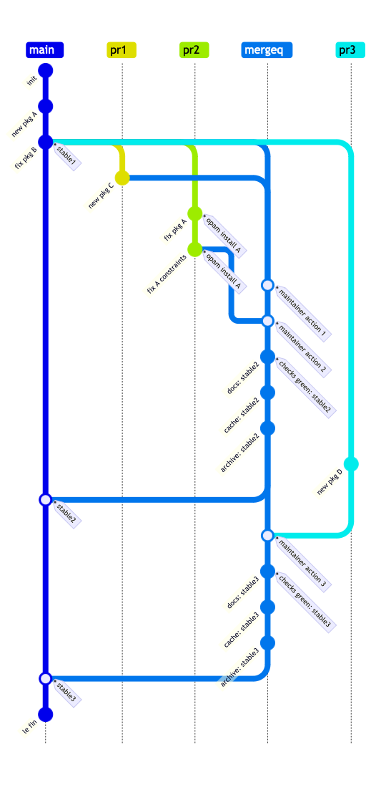

# Improving the opam repository health: Aug 2023

*document status: under discussion by opam-repo maintainers, so still entirely draft*

The opam repository is an OCaml community process in gathering a set of packages and associated constraints from a large number of individuals and organisations.  It has (as of August 2023) now grown to over 28000 descriptions of packages, and attention is needed to its health in the coming years.

To measure the health of the central opam-repository, we posit that the *quantity* of packages should not be a relevant factor, but rather the *quality* of the metadata contained therein.  A high quality database ensures that both newcomers and experienced members of the community can find what they need and encourage participation.

We could define the *quality* of the opam-repository via certain metrics:
- **archived:** The % of packages in the repo whose `url.src` entries are available from the primary entry, have a strong checksum associated with them, and have a backup of the archive available elsewhere (e.g. from the Software Heritage repository)
- **buildable:** The % of packages that are buildable on the primary target (Debian-stable/x86_64), and then on secondary Tier 1 targets (as defined in the OCaml compiler distribution), and subsequently on Tier 2/3 targets that are best effort.
- **documented:** The % of packages for which there is "reasonable" documentation produced for the central OCaml site.  Packages which are endpoint packages that only contain binaries can be marked as such in the metadata so that they can be skipped from the library building and calculations.
- **installable:** The % of packages that are available on Tier 1 platforms as installation candidates. Some packages are inevitably marked as unavailable due to platform constraints, but others are unconditionally unavailable (e.g. due to security alerts).
- **solveable:** Some packages have become very difficult to solve for (as calculated by `opam admin check`) and so put a lot of pressure on the opam solver. We can identify these packages by the amount of time it takes to calculate an installation set, or by some other analysis.
- **liberally licensed:** if the published libraries are to be useful to the community, then they must be under a reasonable (say, OSI-approved) source code license.

Once these metrics have been agreed on, we also need to determine how to improve them.

- **Create an installable package repository for older releases:** If we calculate packages that are _only_ installable on compiler releases lower than the lowest supported version (proposed to be 4.08), then we could move those out of the main opam repository into an opam-repository-archive. This opam-repo-archive should be as standalone and static as possible, but ensures that older packages can still be installed, but with an extra step to add the archive package overlay.
- **Create an overlay repository for unavailable/missing packages:** There are a significant number of packages that are now unavailable or otherwise have no original archives available. Rather than being deleted wholesale, these could be moved out to an opam-repository-broken, where they will sit for eternity but available for package analysis if needed.
- **Introduce documentation metadata:** Define opam fields to mark the documentation expectation from a package. Does odoc lint clearly over it, does it install libraries at all?
- **Support depexts via devcontainers/Nix:** The operating system package managers are increasingly being left behind in terms of keeping up with the latest versions of other language repositories (notably Rust/Cargo and Node/NPM). We need to improve our CI infrastructure to support these or else we are getting a lot of build failures.
- **Simpler maintainer workflow:** Accepting and reviewing a package into the repository is a lot of work right now.  The PR workflow could be improved if the CI were to make it simpler to make metadata fixes directly, and also to reduce the testing overhead for every individual commit (see below for the "merge queue" proposal which addresses this).

Finally, we could improve how the opam repository is actually consumed by users.  Right now, the default opam workflow encourages consuming the very latest tip of the package repository.  We could instead:

- regularly (say, weekly) tag a `stable` version which is used as a base for subsequent website, documentation and archive deployments.
- maintainers can then safely work on `main` as a staging area in which package updates could be reverted easily if a problem is spotted.
- we issue bi-annual versioned releases of the opam package repository at the mid-point between OCaml releases. These releases can be accompanied by a list of opam packages that are *proposed for removal*, which will then be gone from the next stable release. Other major changes to the metadata can also be queued up in these releases, and could also use it as an opportunity to highlight significant ecosystem releases to the wider (non-OCaml) programming community. We anticipate that such a stable package release will also provide useful metadata for downstream OS packagers.

# Workflow: Moving to Merge Queues

## Current State

The current opam repository has multiple systems to handle the following tests and publishing actions against incoming changes:

| Name | Trigger | Tests/Actions
---------|----------|-------
| opam-repo-ci | PR | Are metadata changes to a repository consistent with the rest of the package database?
| opam-repo-ci | PR | Are a subset of packages installable on supported platform/OS/compiler combinations, and would including them break any existing packages?
| health-check | Commit | Are _all_ packages installable on supported platform/OS/compiler combinations?
| ocaml-ci | Commit | Are source code changes to one repository suitable for a future release to opam-repository? 
| ocaml-ci | Commit | Does a repository pass code hygiene conventions (ocamlformat, dunefmt)?
| ocaml-docs-ci | Commit | Publish binary and HTML artefacts from a set of packages.
| base-images-ci | Cron | Publish base images for supported platform/OS/compiler combinations.
| deployer-ci | Commit | Publish the opam.ocaml.org archive and the ocaml.org website |
| opam-publish | CLI | Generate release and publish opam-repo PR
| dune-release | CLI | Generate release, docs and publish opam-repo PR

Users currently have to integrate the various systems separately into their projects, but it does have the advantage that only pieces that are required need to be integrated into a given project.

## Areas for Improvement

There is one central cluster which handles all the builds, and it is very overloaded on a regular basis. The reason is that there are too many jobs being issued for repeated builds that are just very slightly different, and hence not enough binary artefact sharing.  Why is that?

There is **no coordinated sharing** among the CI systems for them to reliably select base commits to build against, and subsequently to exchange binary artefacts from those common commits.  The only current point of coordination is to pick the `HEAD` git commit from opam-repository, and perform all builds from that commit. If the commit is not exactly the same (e.g. due to a package being merged), then all binary sharing is disabled for subsequent PRs.  Importantly, incoming PRs from third-parties cannot safely populate the binary cache without some maintainer approval, as they may poison the cache.

## Merge queues

This note describes a mechanism for all the CIs to begin sharing resources safely, by means of establishing a stronger coordination model around the opam-repository.  We will do this by means of [merge queues](https://docs.github.com/en/repositories/configuring-branches-and-merges-in-your-repository/configuring-pull-request-merges/managing-a-merge-queue) which allows maintainer to queue up multiple PRs into a single queue around which CI systems can operate.

The proposed scheme revolves around not merging packages directly to the `main` branch for opam-repository, but instead queuing them up into a temporary merge queue branch.  Multiple packages can all be merged there, and the CI runs a batch analysis against the changed packages.  Once the merge queue passes tests, it is then merged to the main branch, and any non-merged PRs are rebased against the new tip of the repository.

### opam repository maintainers

Life becomes tremendously easier for opam repository maintainers since:

- they can safely send reasonable-looking PRs to the merge queue without blocking on complete reverse dependency tests.
- the merge queue can publish a set of differential failures against its baseline trunk, and fixes to metadata (such as upper bounds) can be applied against the merge queue.
- multiple big package releases would all be tested simultaneously within the merge queue, and one set of metadata changes applied against all of them.

In return, the opam-repo maintainers need to ensure that the merge queue is not blocked with failures that hold up a lot of packages from being pushed live. In an emergency, the merge queue can be forced pushed to the main branch of the opam repository.

### package submitters

**Big batches:** Multipackage releases from (e.g. Dune or Lwt or Jane Street or Tezos) can be submitted without all the coordination required. Will significantly reduce the time it takes to merge PRs.  For example, if a Dune and a Lwt release land on the same week, then they will all be processed in the merge queue as one bulk build. 

**New submissions:** Better interface for package submissions: the PR can be merged sooner, and the stages of publishing live can be made more obvious and predictable for casual users.

### compiler maintainers

We can also use multiple merge queues to support queuing up large-scale bulk tests (e.g. in preparation for a compiler release, when there lots of pinned tools to test out).

One thing we need to figure out is if it is possible to have a better artefact sharing story when testing packages for failures from OCaml compiler PRs.  While we don't guarantee any ABI compatibility at all without precisely the same compiler, it would be really helpful to have some support.

### website infrastructure

Building the cross-referenced documentation would now be triggered on the merge queue, and so the bulk build could also share the binary artefacts from the merge queue build.  This could significantly speed up some of the website build and reduce the compute resources required.

## Prerequisites to switching

Opam repository metadata has to be as compatible with automated checks as possible for the merge queue to be able to judge whether to push to live or not.

**Package Archives:** We must get all package archive retrievals to 100%.  This will involve making packages with no archives present unavailable, and for those with transient failures to have an automated retrieval story.

**Test failures:** We need a way for "known" test failures to be _quickly_ marked, ideally for a given distro. Instead of putting this into opam-repository, placing this metadata within the CI system allows for more flexible filtering and rapid iteration without a lot of noise in opam-repository.

**Package manifests/docs:** Some packages (notably the myriad of Tezos ones) do not all need documentation built.  Having a way to mark these appropriately in the metadata would let the docs-ci skip it.

## Features unlocked

By adding this infrastructure, we could also deliver new functionality from opam repository.

### Reusable binary caches within automated infra

Once we start sharing binary caches that are built against a `stable` tag in opam-repository, then building other packages becomes much quicker.  Since only maintainers can merge to the mergeq, it should be safe to share the dune cache for builds across the cluster.

- opam-repo-ci: this can run differential tests against the `stable` baseline using the dune cache to greatly speed up previously built packages.
- docs-ci: artefact generation for the trees-of-trees needed by odoc (TODO ask @jonludlam)

### Stable package releases

The stable tags pushed by the merge queues could also be aggregated into binary releases, once we have a relocatable compiler available.

For example, given a regular (say twice-yearly) release of OCaml packages, OS packagers could coordinate to make those versions available on their local package systems rather than ad-hoc version solving.

We could potentially also use this to provide security backports by pulling them into an opam-repository branch.  This would be driven by user demand.

# Who does all this work?

Let's agree on the roadmap we (as opam-repo maintainers) want, and then we can make requests to the various infrastructure/CI teams, and also requests for funding as needed.

- Anil Madhavapeddy (first draft, Aug 2023)
